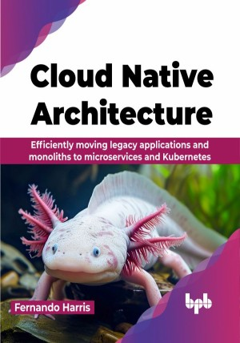

# Cloud Native Architecture

How to plan, design, manage, build, and run monoliths and microservices in an agnostic, scalable, and highly available cloud-native architecture with Kubernetes

This is the repository for [Cloud Native Architecture
](https://bpbonline.com/products/cloud-native-architecture),published by BPB Publications.

## About the Book
The book “Cloud Native Architecture” explains how to plan, manage, build, and run monoliths and microservices in an agnostic, scalable, and highly available cloud-native runtime such as Kubernetes. This is done by effectively applying DevOps principles through the tactical use of CNCF tools. 

You will start by learning about cloud-native technology's history and business reasons. This will help you understand its five key pillars: open-source, containers, distributed architectures, operational benefits, and DevOps integration. We will introduce a framework for adopting cloud-native best practices, focusing on technical and cultural changes. You will learn how to adapt processes like DevOps, Chaos Engineering, Automation, and API First. We will cover automating infrastructure with tools like Prometheus and Grafana, using Kubernetes for container management, and designing applications with microservices. Practical exercises will include setting up CI/CD pipelines with Jenkins and ensuring Kubernetes security. 

By the end of this book, you will be empowered to navigate the Cloud-Native landscape confidently, equipped with the knowledge and practical skills to design, develop, deploy, and migrate applications for the modern cloud era.

## What You Will Learn
• Learn about cloud native's background and its impact on culture and processes.

• Understand Kubernetes concepts, components, and best practices with an agnostic framework.

• Design and build monoliths incrementally on Kubernetes following twelve-factor app principles.

• Transition from monoliths to microservices using specific tools for lifecycle management.

• Address Kubernetes security during application development and deployment.
